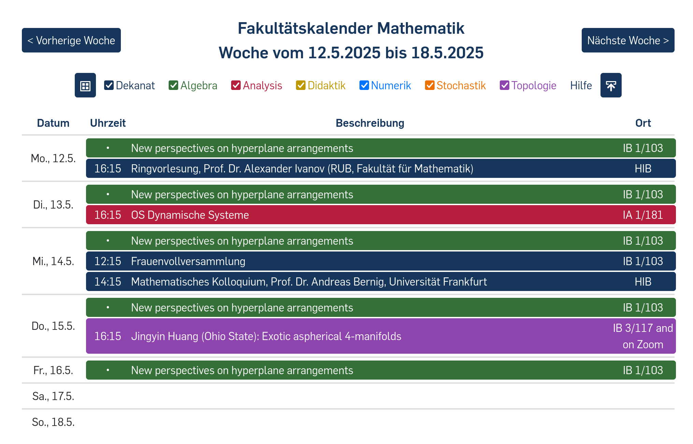

# Web-Calendar
- displays multiple ics-calendars in a browser
- written in html and javascript
- originally designed for the mathematics department at Ruhr University Bochum
- see live in use here: [week/month view](https://math.ruhr-uni-bochum.de/news/kalender/), [semester view](https://math.ruhr-uni-bochum.de/fakultaet/arbeitsbereiche/topologie/oberseminar-topologie/)
## Screenshot the calendar | weekview

## Screenshot the calendar | monthview

## Screenshot the calendar | semesterview

